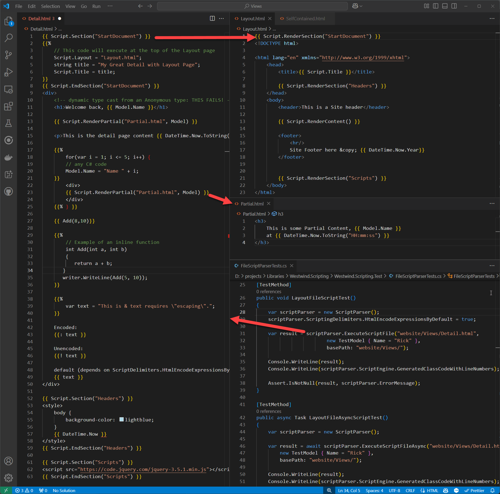

# Westwind.Scripting: Scripts and Template Processing

The `Westwind.Scripting` library includes a Template Scripting engine that allows you to execute string or file based templates and expanded embedded C# expressions and code blocks that can be embedded using Handlebars-like syntax.

The scripting engine supports:

* String based template execution
* File based script execution 
* Support for Layout and Section directives (file scripts only)
* Support for Partials loaded from disk (both string and file scripts)
* Support for Layout Pages and Sections (for file only)
* Expressions and code blocks use raw C# syntax
* Familiar Handlebars syntax with C# code:
    * `{{ C# expression }}`
    * `{{% code block }}`    
       commands can be split across multiple lines, and any other content 
       block - literal text or expressions
    * `{{: html encoded Expression }}`
    * `{{! raw expression }}`
    * `{{@ commented block @}}`
* Code blocks can be use structured statements (for, while, if, using { } etc.)
* Script compiles to plain C# code at runtime
* Compiled code is very efficient 
* ScriptParser instance caches compiled output

`ScriptParser` is built on top of the `CSharpScriptExecution` class which is used for compilation and script execution. The parser class adds the ability to parse the Handlebars-style scripts into C# code that is then executed by the script engine. 

The parser has an internal `ScriptEngine` member, which allows full control over the script compilation and execution so you can add assemblies, get detailed error information, set compiler options etc.

There are two categories of processing:

* **[String Template Script Processing](#string-template-script-execution-scriptparser)**  
String processing involves providing a template as a string and evaluating that string and executing the result code to expand the embedded expressions. String templates tend to be self contained in a single document, although you can use `{{ Script.RenderPartial() }}` to point at a file on disk and embed it's template content into the base template. 

* **[File Script Processing](#westwindscripting-scripts-and-template-processing)**  
File based processing in essence works the same as string template processing, but with files you can take advantage of Layout pages that act as a master template into which detail/content pages are embedded. This is useful for Web output which often uses site branding or base site chrome into which specific content is rendered. File scripts can specify `{{ Script.Layout = "Master.html" }}` and can embed `{{ Script.Section("Headers") }}` that allow injecting the script into the Layout page via `{{ Script.RenderSection("Headers") }}`.

In short file based templates are useful for multi-page Web site content, while template scripts tend to be more useful for common text and code generation tasks.

## String Template Script Execution: ScriptParser
Template script execution allows you to transform a block of text with embedded C# expressions to make the text dynamic by using the `ScriptParser` class. It uses HandleBars like syntax with `{{ }}` expressions and `{{%  }}` code statements that allow for structured operations like `if` blocks or `for`/`while` loops.

There are also several special script operators:

* `{{:` - force Html Encoding
* `{{!` - force Raw Output regardless of settings
* `{{@  commented text @}}` - commented text

> #### Delimiter Customization
> Script delimiters and options can be customized via the `ScriptParser.ScriptingDelimiters` property that allow you can create custom delimiters, to support alternate script tag schemes (classic `<%= %>` for example).
>
> #### Default Html Encoding
> Since Html output generation is very common, there's also an option to HtmlEncode Expression output  by default by setting:
> ```cs
> ScriptParser.ScriptingDelimiters.HtmlEncodeExpressionsByDefault = true`
> ```
> This causes all `{{ expression }}` output to be Html encoded and you can use `{{! expression }}` to explicitly force output to raw string/html output. The default for this setting is `false`.

You can embed C# expressions and code blocks to expand dynamic content that is generated at runtime. This class works by taking a template and turning it into executing code that produces a string output result.

This class has two operational methods:

* `ExecuteScript()`  
This is the high level execution method that you pass a template and a model to, and it processes the template, expanding the data and returns a string of the merged output. There a number of variations for running Async and providing strongly typed models via Generics.

* `ParseScriptToCode()`  
This method takes a template and parses it into a block of C# code that can be executed to produce a string result of merged content. This is a lower level method that can be used to customize how the code is eventually executed. For example, you might want to combine multiple snippets into a single class via multiple methods rather than executing individually.

Templates expose **two special variables**:

* **Model**  
Exposes the model passed when calling the `ExecuteScript()` method or variation. Access with `{{ Model.Property }}` or `{{ Model.MethodToCall("parameter") }}`.

* **Script**  
Allows the ability to render partial templates from disk and embed them into the current page as well as potentially executing nested script code from rendered content. Call these methods with:
    * Script.RenderPartial()
    * Script.RenderPartialAsync()
    * Script.RenderScript()  <small>*(allows content to run script code)*</small>
    * Script.RenderScriptAsync() 

### Automatic Script Processing with ScriptParser
The `ExecuteScript()` method is the all in one method that parses and executes the script and model passed to it.

Here's how this works:

```cs
var model = new TestModel {Name = "rick", DateTime = DateTime.Now.AddDays(-10)};

string script = @"
Hello World. Date is: {{ Model.DateTime.ToString(""d"") }}!
{{% for(int x=1; x<3; x++) {
}}
{{ x }}. Hello World {{Model.Name}}
{{% } }}

And we're done with this!
";

var scriptParser = new ScriptParser();

// add dependencies - sets on .ScriptEngine instance
scriptParser.AddAssembly(typeof(ScriptParserTests));
scriptParser.AddNamespace("Westwind.Scripting.Test");

// Execute the script
string result = scriptParser.ExecuteScript(script, model);

Console.WriteLine(result);

Console.WriteLine(scriptParser.ScriptEngine.GeneratedClassCodeWithLineNumbers);
Console.WriteLine(scriptParser.ErrorType);  // if there's an error
Assert.IsNotNull(result, scriptParser.ScriptEngine.ErrorMessage);
```

Notice that `ScriptParser()` mirrors most of the `CSharpScriptExecution` properties and methods. Behind the scenes there is a `ScriptEngine` property that holds the actual `CSharpScriptExecution` instance that will be used when the template is executed. You can optionally override the `ScriptEngine` instance although that should be rare.

The above code uses `ExecuteScript()` which uses a `dynamic` model. You can also use the `ExecuteScript<TModelType>()` overload to explicitly specify strongly typed model which slightly improves performance and gets around some edge cases where `dynamic` can fail (some null value scenarios typically).


### Manual Parsing
If you want direct access to the parsed code you can use `ParseScriptToCode()` to parse a template into C# code and return it as a string. We can then manually execute the code or create a custom execution strategy such as combining multiple templates into a single class or to inject additional code into the generated code.

Here's the basic functionality to parse a template and then **manually** execute as a method:

```csharp
var model = new TestModel {Name = "rick", DateTime = DateTime.Now.AddDays(-10)};

string script = @"
Hello World. Date is: {{ Model.DateTime.ToString(""d"") }}!
{{% for(int x=1; x<3; x++) {
}}
{{ x }}. Hello World {{Model.Name}}
{{% } }}

And we're done with this!
";

var scriptParser = new ScriptParser();

// Parse template into source code
var code = scriptParser.ParseScriptToCode(script);

Assert.IsNotNull(code, "Code should not be null or empty");

Console.WriteLine(code);

// ScriptEngine is a pre-configured CSharpScriptExecution instance
scriptParser.AddAssembly(typeof(ScriptParserTests));
scriptParser.AddNamespace("Westwind.Scripting.Test");

var method = @"public string HelloWorldScript(TestModel Model) { " +
             code + "}";

// Execute using the internal CSharpScriptExecution instance
var result = scriptParser.ScriptEngine.ExecuteMethod(method, "HelloWorldScript", model);

Console.WriteLine(scriptParser.GeneratedClassCodeWithLineNumbers);
Assert.IsNotNull(result, scriptParser.ErrorMessage);

Console.WriteLine(result);
```

This is a bit contrived since this in effect does the same thing that `ExecuteScript()` does implicitly. However, it can be useful to retrieve the code and use in other situations, such as building a class with several generated template methods rather than compiling and running each template in it's own dedicated assembly.

Not a very common use case but it's there if you need it.

### Nested Script Code
In addition to direct template rendering you can also embed nested template content into the page using the `Script` object which exposed as an in-scope variable. You can use the script object to execute a template from disk or provide a string expression as a template to dynamically execute script in application provided code.

#### RenderPartial
RenderPartial lets you render an external template from disk by specifying a path to the file.

```csharp
var model = new TestModel { Name = "rick", DateTime = DateTime.Now.AddDays(-10) };
string script = """
<div>
Hello World. Date is: {{ DateTime.Now.ToString() }}

{{ await Script.RenderPartialAsync("./Templates/Time_Partial.csscript") }}
Done.
</div>
""";
Console.WriteLine(script + "\n---" );


var scriptParser = new ScriptParser();
scriptParser.AddAssembly(typeof(ScriptParserTests));


string result = await scriptParser.ExecuteScriptAsync(script, model);
Console.WriteLine(result);
Console.WriteLine(scriptParser.GeneratedClassCodeWithLineNumbers);

Assert.IsNotNull(result, scriptParser.ErrorMessage);
```

The template is just a file with text and script expressions embedded:

```csharp
Current Time: <b>{{ DateTime.Now.ToString("HH:mm:ss") }}</b>
```

and if loaded will be rendered in place of the `RenderPartial` call.

When using `ExecuteScript()` and its variants, you can also pass in a `basePath` parameter which allows you specify a root path to resolve via these leading characters:

* `~`
* `/`
* `\`

When these start off the passed in path and a `basePath` is provided the root path is replaced in place of these values (ie. `~/sub1/page.csscript` becomes `\temp\templates\sub1\page.csscript`). 

> You need to be consistent with your use of directory slashes using forward **or** backwards slashes but not both in the base path and template paths or you may run into invalid path issues. 

#### RenderScript
There's also a string version of RenderPartial that uses a string as input for you script.

```csharp
var model = new TestModel { 
    Name = "rick", 
    Expression="Time: {{ DateTime.Now.ToString(\"HH:mm:ss\") }}" 
};

string script = """
<div>
Hello World. Date is: {{ DateTime.Now.ToString() }}
<b>{{ Model.Name }}</b>

{{ await Script.RenderScriptAsync(Model.Expression,null) }}

Done.
</div>
""";
Console.WriteLine(script + "\n---");


var scriptParser = new ScriptParser();
scriptParser.AddAssembly(typeof(ScriptParserTests));


string result = await scriptParser.ExecuteScriptAsync(script, model);

Console.WriteLine(result);
Console.WriteLine(scriptParser.Error + " " + scriptParser.ErrorType + " " + scriptParser.ErrorMessage + " " );
Console.WriteLine(scriptParser.GeneratedClassCodeWithLineNumbers);

Assert.IsNotNull(result, scriptParser.ErrorMessage);
```

Partials - both file and string - are treated as separate scripts so they are compiled and cached in the same ways as top level scripts are. Even a one liner string template is turned into a separate script assembly.

### ScriptParser Methods and Properties
Here's a run down of the key members of the Script Parser:

**Main Execution** 

* `ExecuteScript()`
* `ExecuteScriptAsync()`

**Script Parsing** 

* `ParseScriptToCode()`

**C# Script Engine Configuration and Access**

* `ScriptEngine` 
* `AddAssembly()`
* `AddAssemblies()`
* `AddNamespace()`
* `AddNamespaces()`

The `ScriptEngine` property is initialized using default settings which use:

* `AddDefaultReferencesAndNamespaces()`
* `SaveGeneratedCode = true`

You can optionally replace `ScriptParser` instance with a custom instance that is configured exactly as you like:

```cs
var scriptParser = new ScriptParser();

var exec = new CSharpScriptExection();
exec.AddLoadedReferences();
scriptParser.ScriptEngine = exec;

string result = scriptParser.ExecuteScript(template, model);
```

**Error and Debug Properties**

* `ErrorMessage`
* `ErrorType`
* `GeneratedClassCode`
* `GeneratedClassCodeWithLineNumbers`

> The various `Addxxxx()` methods and error properties are directly forwarded from the `ScriptEngine` instance as readonly properties.

### Some Template Usage Examples
An example usage is for the [Markdown Monster Editor](https://markdownmonster.west-wind.com/) which uses this library to provide text snippet expansion into Markdown (or other) documents.

A simple usage scenario might be to expand a DateTime stamp into a document as a snippet via a hotkey or explicitly

```markdown
---
- created on {{ DateTime.Now.ToString("MMM dd, yyyy") }}
```

You can also use this to expand logic. For example, this is for a custom HTML expansion in a Markdown document by wrapping an existing selection into the template markup:

```markdown
### Breaking Changes

<div class="alert alert-warning">
{{ await Model.ActiveEditor.GetSelection() }}
</div>
```

Here's an example that uses script to retrieves some information from the Web parses out a version number and embeds a string with the version number into the document:

```markdown
{{%
var url = "https://west-wind.com/files/MarkdownMonster_version.xml";

var wc = new WebClient();
string xml = wc.DownloadString(url);
string version =  StringUtils.ExtractString(xml,"<Version>","</Version>");
}}
# Markdown Monster v{{version}}
```

This is a bit contrived but you can iterate over a list of open documents and display them in the template output:

```markdown
**Open Editor Documents**

{{% foreach(var doc in Model.OpenDocuments) { }}
* {{ doc.Filename }}
{{% } }}

```

## File Script Execution: Layout Pages and Sections
File based processing is very similar to the string based template expansion, but there are some additional features that file based scripts allow for:

### Layout Pages
A Layout page is a 'master' page into which content pages are rendered. Content pages request a layout page file with `{{ Script.Layout = "Layout.html" }}`. This feature is primarily used for generating Web content where Layout pages make up the Site Chrome (headers and footers, sidebars etc.) typically. Many detail pages can use the same shared Layout page to render the base site layout into which the content page is rendered via `{{ Script.RenderContent() }}` in the Layout page. Layout pages are like other script pages and you can use expressions and codeblocks and partials inside them, just as the start content page.

### Sections
Layout pages can contain `Sections` that allow a content page to inject partial script code into the Layout page. Layout pages define `{{ Script.Section("Headers" }}` to specify a target location for a section, and content pages provide a `{{ Script.BeginSection("Headers") }}` and `{{ Script.EndSection("Headers") }}` to provide the content to be embedded into the Layout page.

### Basic File Scripts
To be clear, Layout Pages and Sections are entirely optional features for file based scripts and you can certainly create single file script files or single files that load partials with `{{ Script.RenderPartial("Partial.html") }}`.

## Examples of Script Files
The following are a set of example files that demonstrate all of the following:

* Disk based script content page
* Disk based Layout Page
* Embedded Sections in Layout Page
* Partials rendered from Content and Layout Pages

To see everything in one consolidated view here's screen capture that shows all the related files:



### C# Code to Execute a Script File
Let's start with the code to execute the script (you can try this in the Test project):

```csharp
[TestMethod]
public void LayoutFileScriptTest()
{
    var scriptParser = new ScriptParser();
    
    // since we're generating HTML encode expressions by default
    scriptParser.ScriptingDelimiters.HtmlEncodeExpressionsByDefault = true;

    var result = scriptParser.ExecuteScriptFile("website/Views/Detail.html",
                        new TestModel { Name = "Rick" },
                        basePath: "website/Views/");

    Console.WriteLine(result);
    Console.WriteLine(scriptParser.ScriptEngine.GeneratedClassCodeWithLineNumbers);
    Assert.IsNotNull(result, scriptParser.ErrorMessage);
}
```

This should look familiar - it's pretty much exactly the same as you would call a template with `ExecuteScript()` in the prior sections except you specify a file name instead of the script code.
You call `ExecuteScriptFile()` or `ExecuteScriptFileAsync()` (if you need to process async code anywhere in the script).

### Main Content Page (Detail.html)
So the example I use here demonstrates:

* A content page that has a Layout Page specified
* Content contains several Partials
* Content has several Sections to inject into Layout

```html
{{ Script.Section("StartDocument") }}
{{%
    // This code will execute at the top of the Layout page
    Script.Layout = "Layout.html";
    string title = "My Great Detail with Layout Page";
    Script.Title = title;
}}
{{ Script.EndSection("StartDocument") }}
<div>
    <h1>Welcome back, {{ Model.Name }}</h1>

    {{ Script.RenderPartial("Partial.html", Model) }}

    <p>This is the detail page content {{ DateTime.Now.ToString("t") }}</p>

    <!-- Embedded structured code with detail in between -->
    {{% 
        for(var i = 1; i <= 5; i++) {  
        // any C# code
        Model.Name = "Name " + i;
    }}            
        <div>
        {{ Script.RenderPartial("Partial.html", Model) }}
        </div>
    {{% } }}

    <!-- Method calling inline function below -->
    {{ Add(8,10)}}    
    
    {{%
        // Example of an inline function
        int Add(int a, int b)
        {
           return a + b;
       }
       writer.WriteLine(Add(5, 10));        
    }} 
  
    {{%
        var text = "This is & text requires \"escaping\".";
    }}

    Force Encoded:   
    {{: text }}

    Force Unencoded: 
    {{! text }}

    default (depends on ScriptDelimiters.HtmlEncodeExpressionsByDefault):
    {{ text }}
    
    
    {}
</div>

{{ Script.Section("Headers") }}
<style>
    body {
        background-color: lightblue;
    }
    {{ DateTime.Now }}
</style>
{{ Script.EndSection("Headers") }}

{{ Script.Section("Scripts") }}
<script src="https://code.jquery.com/jquery-3.5.1.min.js"></script>
{{ Script.EndSection("Scripts") }}
```

The code starts with a Section at the very top which can be useful if you need to pass or create values that need to be used at the top of the layout page. Keep in mind that code is written from top to bottom with the Layout Page at the top, with the content rendered into it. By the time the code in content renders the top of the Layout Page has already rendered, so if you need code that dynamically sets values to embed into the Layout page like the Script.Title for example, you'll want to use a Section at the top of the document like the example.

Next some basic script expansion. Note that the Model passed to the Detail page is automatically available in the Layout page so `{{ Model.Name }}` works to expand.

Next there's a partial page that is rendered with `{{ Script.RenderPartial("Partial.html") }}`. Partial Pages are separately loaded and compiled at runtime, unlike the Layout/Content pages which are merged and executed as a single page.

The next block shows how to create and call an inline method with a code block and call it with an expression or by explicitly writing out via `{{ writer.WriteLine() }}`. Note that methods are pulled forward into code so you can call methods **before they have been defined**:

```html
<!-- can call before definition -->
{{ Add(8,10)}}    

{{%
    // Example of an inline function
    int Add(int a, int b)
    {
       return a + b;
   }
   
   // You can write output from within a code block
   writer.WriteLine(Add(5, 10));        
}}

<!-- this also works obviously -->
{{ Add(8, 10) }} 
```

### Html Encoding
If you're generating Web output for display in a browser you likely want to encode most text written out from expressions as Html Encoded strings to minimize cross-script attacks from script code in potentially user facing text and just for proper display in Html.

**By default expressions are not Html Encoded**. You can explicitly force individual expressions to be Html encoded with `{{: expr }}` syntax:

```csharp
string script = @"Hello World, {{: Model.Name}}";

// Executed script produces
// Hello World, Rick &amp; Dale
```

Alternately you can automatically encode all `{{ expr }}` using `HtmlEncodeExpressionsByDefault=true` and then alternately explicitly force raw text with `{{! expr }}`
 
```csharp
var scriptParser = new ScriptParser();

// Automatically encode any {{ expr }} 
scriptParser.ScriptingDelimiters.HtmlEncodeExpressionsByDefault = true;

var model = new TestModel { Name = "Rick & Dale"};
string script = @"
Hello World, {{ Model.Name}}

Hello unencoded World {{! Model.Name }}
";

var scriptParser = new ScriptParser();
scriptParser.ScriptingDelimiters.HtmlEncodeExpressionsByDefault = true;
  
scriptParser.AddAssembly(typeof(ScriptParserTests));
scriptParser.AddNamespace("Westwind.Scripting.Test");

string result = scriptParser.ExecuteScript(script, model);
```

If you execute this you should get the following text with the first value encode by default expression, and the second unencoded by way of the raw override.

```text
Hello World, Rick &amp; Dale

Hello unencoded World, Rick & Dale
```

Note that functions that you call that want to embed raw html when auto encoding is on by using the `IRawString` interface. 

You can use `{{! expr }}` or `{{ Script.Raw(value) }}` to return a raw string. `Script.Raw()` (and also `new RawString(value)` and `RawString.Raw(value)`) return `IRawString` and if you call methods that want to explicitly return raw HTML they can return an `IRrawString` instance:

```cs
public IRawString CallMe() 
{
    return new RawString("Call me");   
}
```

Here's another example that demonstrates HTML encoding:

```html
{{%
    var text = "This is & text requires \"escaping\".";
}}

Encoded:  
{{: text }}

Unencoded: 
{{! text }}
{{ Script.Raw(text) }}
{{ RawString.Raw(text) }}
{{ new RawString(text) }}


default (depends on ScriptDelimiters.HtmlEncodeExpressionsByDefault):
{{ text }}

{{%
    // write from within code blocks
    writer.WriteLine("Hello world, " + Model.Name);  // unencoded
    
    // write with HtmlEncoding
    writer.WriteHtmlEncoded( $"this text is basic {Model.Name}, but \"encoded\".\n" );
}}
```

The raw HTML output generated is:

```txt
Encoded:  
This is &amp; text requires &quot;escaping&quot;.


Unencoded: 
This is & text requires "escaping".
This is & text requires "escaping".
This is & text requires "escaping".
This is & text requires "escaping".

default (depends on ScriptDelimiters.HtmlEncodeExpressionsByDefault):
This is &amp; text requires &quot;escaping&quot;.

Hello world, Rick
this text is basic Rick, but &quot;encoded&quot;.
```

### Layout Page
So far we've only looked at the content page. The content page requests a Layout page via:

```html
{{%
    Script.Layout = "Layout.html";
    Script.Title = "My Great Page Caper";
}}
```

This instructs the parser to load `Layout.html` and then embed the content of this content page into it, where the Layout page specifies:

```html
{{ Script.RenderContent() }}
```

Here's what the full layout page looks like:

```html
{{ Script.RenderSection("StartDocument") }}
<!DOCTYPE html>

<html lang="en" xmlns="http://www.w3.org/1999/xhtml">
    <head>
        <title>{{ Script.Title }}</title>
   
        {{ Script.RenderSection("Headers") }}
    </head>
    <body>
        <header>This is a Site header</header>
        
        {{ Script.RenderContent() }}

        <footer>
            <hr/>
            Site Footer here &copy; {{ DateTime.Now.Year}}
        </footer>


        {{ Script.RenderSection("Scripts") }}
    </body>
</html>
```

The first thing at the top is a Section called StartDocument. This is a good idea if you need to pass C# values from the content page into the Script page before the Layout page starts rendering anything. A common thing to set in this `StartDocument` section is the page title if the title has to be dynamically created. The parser automatically picks up literal strings for `Script.Title` in the Content page, but it can't automatically determine the value if it is dynamic - for this you need to inject a section into the layout that effective sets this value. 

Alternately you could also use a value on the Model but that is often not ideal as the model reflects a specific data set.

The top of the document then renders the title that was injected with `{{ Script.Title }}` and then renders another section. Note that sections don't have to exist in the content page - they are only pulled if they exist and ignored if they don't.


Next comes the content injection via `{{ Script.RenderContent() }}`. This pulls in the content of the content page essentially merging both documents into a single script that is then parsed and executed as a single C# code file.

Finally there are a couple more expressions and another RenderSection for optionally embedding scripts on the bottom of the page.

### Sections
You've seen sections in the previous paragraphs. Sections are defined in a Layout page as a placeholder via `{{ Script.RenderSection("SectionName") }}` and implemented in Content pages via `{{ Script.Section("SectionName") }}` and `{{ Script.EndSection("SectionName") }}`. Any content between the two - literal text, expressions and code blocks are then embedded in the Layout page at the section placeholder location.s

**Layout Page**

```html
<head>
    <title>{{ Script.Title }}</title>
    {{ Script.RenderSection("Headers") }}
</head>
```


**Content Page**

```html
{{ Script.Section("Headers") }}
<style>
    body {
        background-color: lightblue;
    }
    <script> 
        var viewMode = { Name:"{{ Model.Name }}" };
    </script>
</style>
{{ Script.EndSection("Headers") }}
```

### Partials
Unlike Layout and Content pages which merge into a single document, partials are rendered like a standalone page based on a file on disk. For Html rendering Partials are typically Html fragments for a page sub-component.

```html
<h3>
    This is some Partial Content, {{ Model.Name }} 
    at {{ DateTime.Now.ToString("HH:mm:ss") }}
</h3>
```

Partials can be called from Content Pages, Layout Pages and even from other Partial pages using the following syntax:

```html
<hr />
    {{ Script.RenderPartial("Partial.html", Model) }}
<hr />
```


